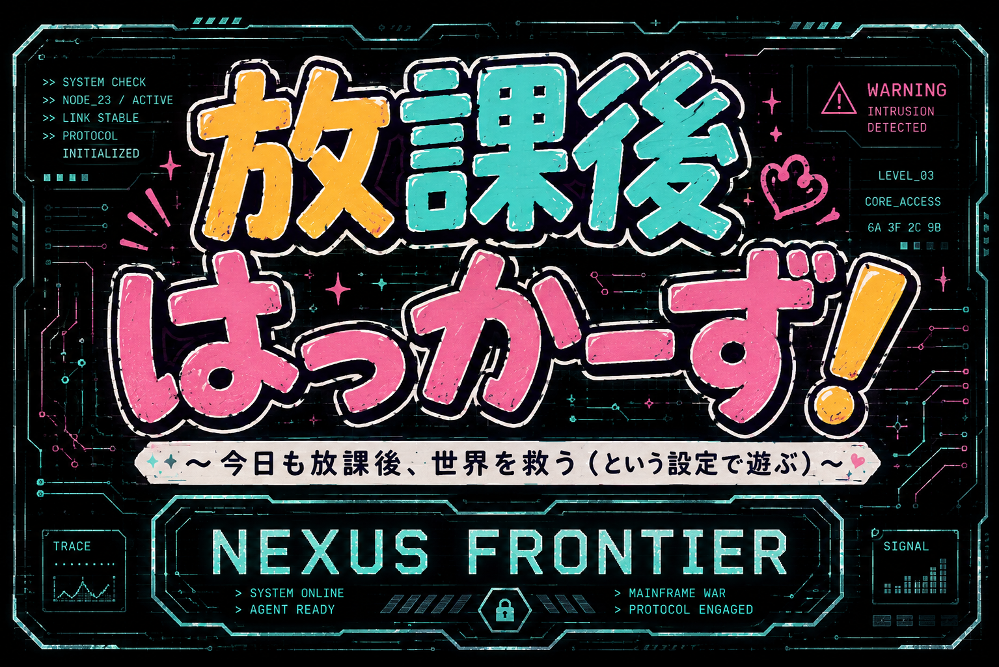

# 放課後はっかーず！

### 〜今日も放課後、世界を救う（という設定で遊ぶ）〜

> 「サイバー戦争ごっこ」を本気で楽しむ、「天才こはるがかんがえたさいきょうのオリジナルカードゲーム」

**ルールやドキュメント、画像も含めて全部生成AIと壁打ちしながら作ってもらってるよ。**

**つまり、生成AIを相棒にして、どんだけのゲームができるのかという実験を兼ねてます。**

---

# 概要

**『放課後はっかーず！』** は、女子中学生たちが放課後に遊ぶオリジナルカードゲームを題材としたブラウザゲームです。

プレイヤーは電子戦の司令官となり、侵入プログラムと防御プロトコルを駆使して、相手メインフレームへの侵入を目指します。

……という設定のカードゲームを、私たちは今日も放課後に遊んでいます。

ゲーム中では、本格的なサイバーパンクSFの世界観と、放課後の交流というゆるい日常とのギャップを楽しめ…たらいいな。

---

# 特徴

* シンプルなルールで奥深い読み合い
* ライフ管理と攻守交代が勝負を左右するゲームシステム
* フィールド縮小による終盤の緊張感
* レトロフューチャーな軍用コンソール風UI
* HTML / CSS / JavaScript によるブラウザゲーム
* スマートフォン・PC両対応を想定

---

# プロローグ

西暦20XX年。
人類はすでに物理的な衝突を必要としなくなっていた。

世界を支配する二大ネットワーク企業は、
互いのメインフレームへ侵入プログラムを送り込み、
終わりなき電子戦を続けていた。

勝利条件はただ一つ。

敵中枢への侵入。

最強の攻撃プログラムを実行し、
相手の防衛プロトコルを突破せよ。

――という設定のカードゲームを、
私たちは今日も放課後に遊んでいる。

---

# 開発状況

現在開発中です。

進行状況は GitHub のコミット履歴およびドキュメントで管理しています。

---

# 開発環境

* HTML5
* CSS3
* JavaScript (Vanilla JS)　←**しれっとChatGPTが出してきた！mjdsk？**

---

# ドキュメント

| ファイル              | 内容            |
| ----------------- | ------------- |
| GDD.md            | ゲームデザインドキュメント |
| 01_GameRules.md   | ゲームルール        |
| 02_Cards.md       | カード仕様         |
| 03_UI.md          | UI仕様          |
| 04_World.md       | 世界観           |
| 05_Characters.md  | キャラクター        |
| 06_Scenario.md    | イベント・シナリオ     |
| 07_CPU.md         | CPU思考         |
| 08_Development.md | 開発メモ          |
| DecisionLog.md    | 仕様変更履歴        |

---

# ライセンス

未定
